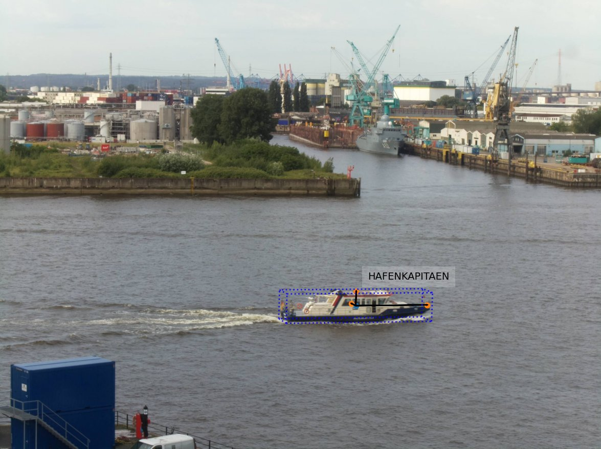

<div>
  <h1>
    Fusing Monocular RGB Images with AIS Data to Create a 6D Pose Estimation Dataset for Marine Vessels
  </h1>
</div>

[](https://arxiv.org/abs/2508.14767)

#  [BONK-pose](https://fabianholst.github.io/BONK-pose/)
Boats On Norderelbe at Kehrwieder
### A 3D bounding box estimation Dataset for Marine Vessels
The BONK-pose dataset is a 3D bounding box estimation dataset for marine vessels, created by fusing monocular RGB images with Automatic Identification System (AIS) data. It addresses the gap in maritime datasets by providing fully annotated 3D bounding boxes for vessel pose estimation. 

BONK-pose does not rely on human annotation effort, the 3D bounding boxes are instead derived by a data fusion algorithm, that corrects and enriches the pose information of a AIS base prior.

The dataset consists of 3,753 images with 3D bounding box annotations including location, vessel dimensions and orientation. In those images 3,829 vessel are annotated.



## [More information](https://fabianholst.github.io/BONK-pose/)

## Citation
If you use this dataset, please cite the following paper, which is currently under review at [IEEE Journal of Oceanic Engineering](https://ieeexplore.ieee.org/xpl/aboutJournal.jsp?punumber=48):

```
@article{holst2025fusing,
  title={Fusing monocular RGB images with AIS data to create a 6d pose estimation dataset for marine vessels},
  author={Holst, Fabian and G{\"u}lsoylu, Emre and Frintrop, Simone},
  journal={arXiv preprint arXiv:2508.14767},
  year={2025}
}
```
